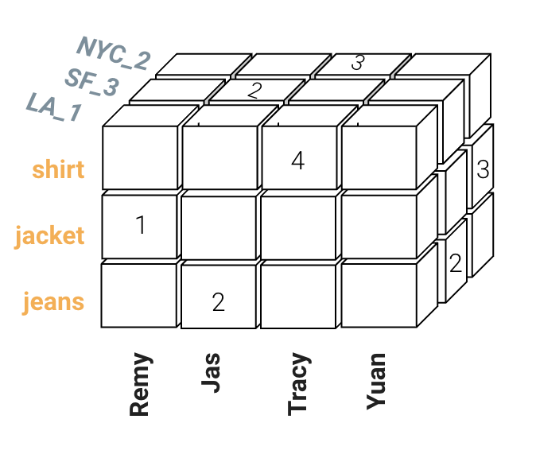
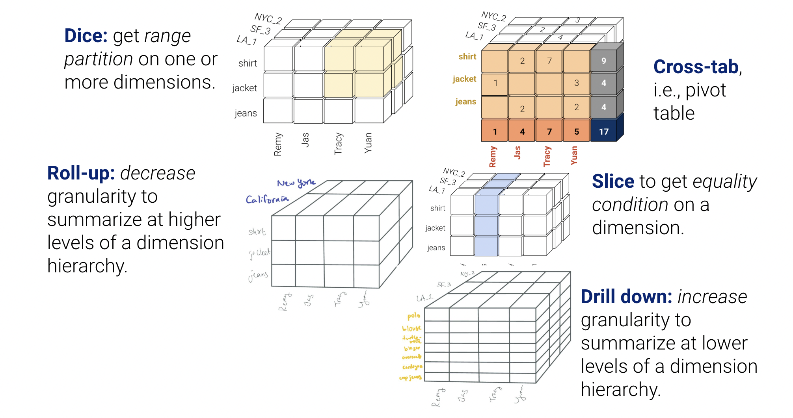
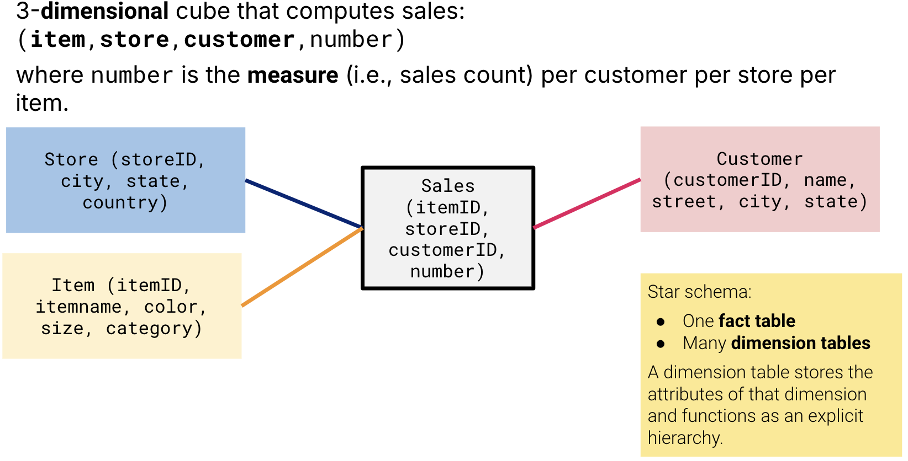
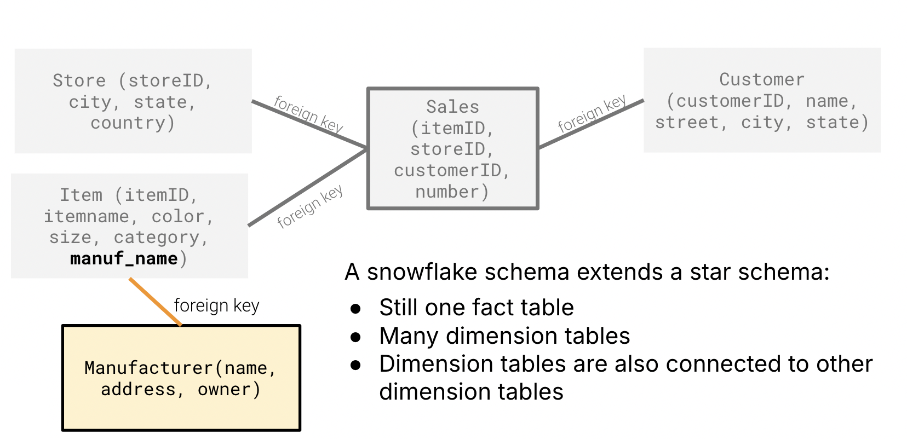

**Last Updated:** December 13th, 2024

# Business Intelligence (BI)
Business Intelligence (BI) focuses on analyzing data to make better business decisions. It often uses a data warehouse, which is the result of an ELT (Extract, Load, Transform) process. BI tools allow managers or analysts to easily generate reports, analyze trends, and build spreadsheets, all without needing to know where the data is stored or how it's processed behind the scenes.

BI involves two key technologies: **OLAP (OnLine Analytical Processing)** and **OLTP (OnLine Transaction Processing)**. These systems handle and process data differently (We focus on OLAP in this course):

## OLAP 
- **Purpose**: large volumes of data for decision making
- **Structure**: Read/summarize large volumes of multidimensional data
    - Read-only queries, multiple sources
    - Longer response times (secs)
- **Volume**: Large storage requirements (TB / PB)
- **Model**: Star schema / snowflake schema
- **Example**: Predicting consumer behavior such as finding the total sales of each type of Honda car over time for each county. 

OLAP systems fundamentally provide **comprehensive, summarized** views of data in data warehouses.

This summarization can and will happen across **multiple dimensions** of data. One such representation is a **data cube**, aka **OLAP cube**.

### OLAP Operations
It turns out that the five common operations that OLAP supports—cross-tab, slice and dice, roll-up and
drill-down—can all be represented via the cube. 

### OLAP Architecture Type
**MOLAP (Multidimensional OLAP)**
- Data cube stored as a multidimensional array storage
- Optimized multidimensional array (i.e., not dense)
- Pre-compute materialized slices, cross-tabs, different cube granularities. Benefits from fast response to queries but expensive ETL time

**ROLAP (Relational OLAP)**
- Data cube is stored as a star/ snowflake schema in relational DBMS
- Can be implemented in SQL (WHERE, GROUP BY, plus CUBE/ROLL UP)
- No pre-computation, needs SQL knowledge to specify new materialized views
- Supports generalized SQL tools

**HOLAP (Hybrid OLAP)**
- Some data stored in relational storage; other data stored in specialized storage
- The exact proportions are left to the specific OLAP system & the designer

## OLTP 
- **Purpose**: manage and process real time transactions 
- **Structure**: Read, insert, update, and delete data in relational databases
    - Read-write queries, single source
    - Shorter response times (ms)
- **Volume**: Smaller storage requirements (GB)
- **Model**: Normalized / denormalized models
- **Example**: Processing payments and customer data such as appending a new car sale into the sales table.

## Star vs. Snowflake Schema
The data cube is a **mental model** of a a multidimensional tensor. We need a **physical model** to store our data / connect relations to inherently reconstruct this data cube.

**Star Schema**:
- Has one centralized fact table from which many dimension tables are connected to the fact table
- This creates a visualization of a center node with many arms, like a multi-pointed star.

**A snowflake schema extends a star schema**:
- Still one fact table
- Many dimension tables
- Dimension tables are also connected to other dimension tables

